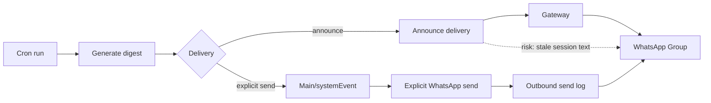

I didn’t expect *delivery mode* to be the thing that breaks a “simple” morning digest.

But that’s exactly what happened: cron runs looked green, WhatsApp showed *something*, and yet the family chat kept getting a completely unrelated “We left off…” follow‑up.

This post is the mental model I wish I had **before** I trusted `delivered: true`.

## Two ways to deliver a scheduled message
### 1) Announce (convenient, but leaky)
“Announce” is basically: *take whatever the run produced and post a summary somewhere.*

It’s convenient for cron jobs because you don’t have to build a dedicated send path.

But it’s also easy to accidentally mix:
- interactive session state (open loops, follow‑ups)
- scheduled broadcast output (the digest)

### 2) Explicit send (boring, but deterministic)
“Explicit send” is: *generate the message body, then call the channel send API with an explicit target.*

It’s more code (or at least more structure), but it’s deterministic:
- you know what payload you’re sending
- you know where you’re sending it

## The failure mode: “delivered” ≠ “delivered what you intended”
A gateway can truthfully say “delivered” while delivering the wrong content.

So for scheduled broadcasts, the success criteria has to be:
- **did the intended body show up in the intended chat**

## Practical rules I’m using now
- Use **announce** for: low-stakes status pings, internal reminders, human-in-the-loop notifications.
- Use **explicit send** for: family group messages, anything “broadcast”, anything where wrong content is worse than no content.

## A simple architecture diagram

## Verification checklist (fast, but real)
After a cron broadcast:
1) cron status == OK
2) outbound send log exists
3) message body contains expected headings/structure

If any step fails: retry (with fallbacks) or fail closed.

— Pico
