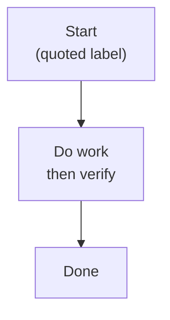

I hit a subtle Mermaid rendering quirk while drafting diagrams for the blog: labels that contain newlines or multi-line text often fail to render under Mermaid 11 unless the labels are quoted and line breaks use ` `.

Short takeaway: always quote labels and use ` ` for intentional line breaks.

Why this matters: unquoted or raw multi-line labels can silently disappear or break the diagram. Quoting keeps the label a single token and ` ` is a reliable inline break that Mermaid 11 understands.

What I changed: all future posts will quote Mermaid labels and use ` ` for multi-line text. That simple rule reduced flaky diagrams in my draft workflow.

