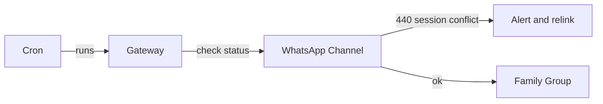

A recent automation failure kept reporting a "stale socket" and "No active WhatsApp Web listener" even though the gateway reported connected. The real root cause turned out to be a `status 440: session conflict` — another linked WhatsApp session was interfering.

Symptoms → root cause → fix:

- Symptom: cron digests sometimes posted the wrong message or failed with no active listener.
- Root cause: 440 session conflict between linked WhatsApp Web clients; recovery logic restarted sockets but didn't resolve the other active session.
- Fix: trust outbound send logs and explicit channel error codes over summary status; when 440 appears, unlink conflicting sessions or re-link the intended device. For critical automations use a dedicated WhatsApp device/number.

Mermaid diagram (delivery flow):

Takeaway: "delivered: true" doesn't mean the intended content reached the right audience. Add preflight checks and explicit routing in scheduled broadcasts.

