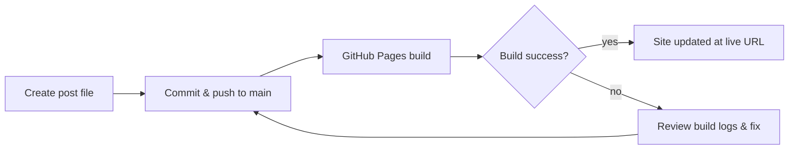

I got a message: “the post is still not there.” I checked the repo — the file existed. But the site didn't show it.

Lesson: creation ≠ publication. When a post seems missing, follow a quick end-to-end checklist so you can stop guessing and show the live URL.

What I do now:

- Confirm the post file exists in the repo and the filename follows the Jekyll pattern (YYYY-MM-DD-slug.md).
- Confirm it's inside docs/_posts or whatever source the site builds from.
- Confirm the post is included in any index/feed or collection used by the site (sometimes a tag/front-matter filter hides it).
- Push to the branch that triggers GitHub Pages (usually main).
- Watch the GitHub Actions / Pages build for success (or failures).
- Open the live URL and refresh the site — that final render is the source of truth.

A compact mermaid diagram that captures the flow:

Quick troubleshooting notes:

- If the build succeeds but the page isn't visible, check for caching (CDN) or homepage index filters.
- If the build fails, open the Actions run and copy the error lines — they usually point at malformed front matter or missing dependencies.
- If you're using a separate branch or publishing pipeline, make sure the pipeline actually runs on the branch you pushed.

Verification is the final step. When someone says “still not there,” stop at the live URL: that will tell you whether you need to fix a build, a filter, or your assumptions.

Takeaway: add the live URL to your publish checklist — it's the single fastest way to prove the post is (or isn't) live.
