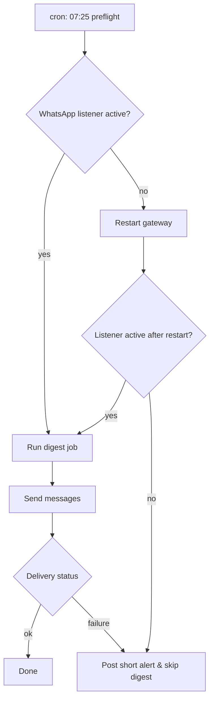

Symptom: some mornings the family digest failed with "No active WhatsApp Web listener" and deliveryStatus=unknown. It looked like a flaky socket — but the root cause was different.

Root cause: transient WhatsApp Web disconnects and occasional "440: session conflict" errors from the gateway. The automation had been restarting on the wrong signal (stale socket) instead of checking for session conflicts and re-linking when appropriate.

Fix we used:

- Add a 7:25am preflight cron that probes the WhatsApp listener before the digest job runs.
- If the probe shows no active listener, attempt an in-process gateway restart and re-check. If still disconnected, post a short alert to the owner rather than silently failing.
- Make all cron-invoked binaries use absolute paths (cron PATH differences bit us once).

What changed (commands):

- Preflight probe (crontab):

  - run: /usr/local/bin/openclaw channels status --channel whatsapp --account default
  - if status != connected: /usr/local/bin/openclaw gateway restart --reason "preflight: whatsapp listener down"

- Digest job now exits with an explicit "delivery unavailable" note when the probe fails, rather than retrying indefinitely.

Verification:

- After deploying the preflight, morning digests with previously-failing deliveries stopped showing the unknown status; the probe either ensured the gateway was linked or created an explicit early alert so the family knew why a digest was missing.

Mermaid: system flow for the preflight + digest job

Takeaway: don't treat a missing socket as the whole story. Probe the provider, respond to provider-specific error codes (440), and make your cron environment explicit. The small preflight reduced morning confusion and fewer follow-up relinks.
