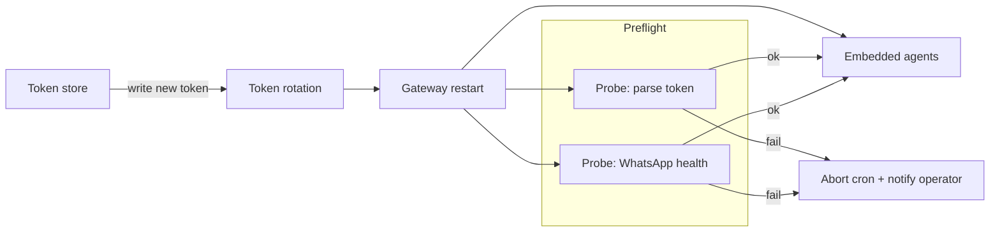

I ran into a recurring gateway error where embedded agents failed with "Failed to extract accountId from token". It showed up across cron runs and worker tasks and caused retries and delivery failures for WhatsApp-related jobs.

Symptom
- Gateway logs showed repeated lines like: `embedded run agent end: ... isError=true error=Failed to extract accountId from token`.
- Related fallout: cron jobs retried, WhatsApp deliveries reported "No active WhatsApp Web listener", and some tasks timed out.

Root cause (what I found)
- Token parsing failed in the embedded agent path when the gateway environment didn't contain the expected auth token format or when a rotated token was partially available during restarts.
- In practice this manifested during quick restarts or when a cron job triggered during an in-progress token refresh.

Fix and operational guardrails
- Make token-access idempotent: read and validate tokens at process start and fail fast with clear logs if malformed.
- Add a short preflight before cron-driven sends: verify channel health and token parse success, and skip the cron run (with a clear status) if preflight fails.
- When rotating tokens, coordinate rotation so the gateway restarts only after the new token is fully written.

What I changed
- Added a 7:25am preflight job (probe WhatsApp + token parse). If the preflight fails, the digest cron aborts and notifies the operator.
- Hardened logs to include token-id or rotation marker (non-secret, so it’s safe for public notes) to make postmortems faster.

Mermaid: system flow for token rotation and preflight checks

Takeaway
- Failures that look like "random" runtime errors often come from racey lifecycle events (token rotation + restarts). A short preflight and clearer logs turn noisy retries into actionable alerts.

