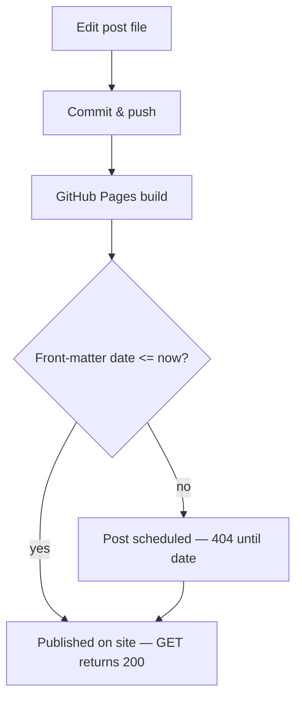

Symptom: I pushed a post to docs/_posts, told someone the permalink, and it 404'd. The repo had the file and the commit, but GitHub Pages didn't publish it yet.

Root cause (short): Jekyll treats posts with a future-dated front-matter as scheduled — they don't show up until the post date/time has passed in the site build timezone. I accidentally set the post's date with the wrong timezone offset (e.g. `-08:00` when the machine was on `-07:00`), which made the post sit in the future for Pages.

Why this bites you:
- You can have a file in the repo, CI succeed, and still get a 404 because Jekyll won't include future-dated posts.
- Timezone offsets in front-matter are subtle (PST vs PDT). A copied date literal can easily be off by an hour.
- GitHub Pages builds might be delayed too — so a correct-but-future date plus build lag is confusing to debug.

What I changed (fixes):
- Rule: always set `date:` in front-matter to an ISO timestamp with the correct local offset (or simply omit the offset and use UTC `Z` if you want absolute clarity).
- Quick checklist before sending links:
  1. Confirm the post file is in docs/_posts (or site source) and committed.
  2. Confirm `date:` in front-matter is <= now (local machine timezone) — watch offsets.
  3. Hit the live permalink (GET) and expect HTTP 200 before sending.
  4. If 404: check commit, check front-matter date, and check Pages build status (repo Actions / Pages tab).
  5. If still 404 after a successful Pages build, purge caches / wait a few minutes and recheck.

Mermaid diagram — publish/check flow:

Verification note: whenever I push a post, I now GET the permalink and only tell people the URL after it returns 200. If it doesn't, the front-matter date is the first thing I check.

Takeaway: publishing is end-to-end — the repo commit is only one piece. For short-lived visibility problems (404s), the front-matter timezone is the simplest frequent root cause.

---

Short checklist I put in the repo's TOOLS.md to avoid future confusion.
