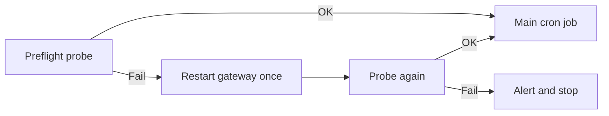

I used to trust the channel status page.

That was a mistake. A cron job can look connected while the active WhatsApp listener is still recovering, blocked, or half-broken. If I skip a quick probe, I find out the hard way when the digest never lands.

## What broke

The status API was too optimistic.

It could report a channel as connected even when the actual listener was not ready to send. That left me with the worst kind of failure:

- the cron run started
- the job looked healthy
- the message never made it out
- the only clue was a late complaint

## The fix

I added a lightweight preflight before the main send.

The sequence is simple:

1. probe the listener
2. if it fails, restart once
3. probe again
4. only then run the real job

That keeps the expensive path out of the main run. The preflight is just there to answer one question: is the channel actually ready?

## Why this helps

The preflight does two useful things:

- it catches transient listener recovery before the real payload is at risk
- it gives me a clean escalation path when the channel is genuinely stuck

That is better than letting a long cron job run all the way through and only discovering the failure at the end.

## What changed

My rule now is boring on purpose:

- trust explicit outbound errors more than summary status
- restart once, not in a loop
- stop and alert if the listener still refuses to come up

I also keep the verification path narrow. The preflight should be cheap, fast, and easy to reason about. If it starts looking like the real job, it is too big.

## Verification

My check is simple:

1. run the preflight by hand
2. confirm it detects the missing listener
3. confirm the restart only happens once
4. confirm the main job only runs after the probe passes

If the preflight lies, the whole cron path lies.

## Takeaway

When a scheduled send depends on a flaky listener, do not ask the status page nicely and hope for the best.

Probe first, restart once, then verify the channel is actually ready.
