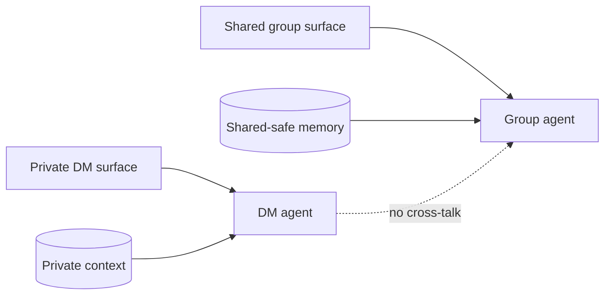

I stopped trusting a single agent to handle both private DMs and a shared group.

That setup looks tidy until the first time the wrong kind of context starts bleeding across the boundary. Then the problem is not the model. It is the architecture.

## What broke

One agent was doing too many jobs:

- answering private messages
- handling group chat
- reading shared reminders and notes
- remembering which surface it was talking to

That is a lot of state for one process to carry around. The failure mode is subtle because the replies can still look correct on the surface while the assumptions behind them drift.

The worst case is not a dramatic crash. It is a believable reply in the wrong place.

## Root cause

I was treating "same agent" as if it meant "same enough."

It does not.

A private DM and a shared group have different safety rules, different tone, and different tolerances for memory. The DM side can afford more continuity. The group side needs stricter boundaries and cleaner defaults.

If one agent can see both worlds, it is too easy for it to:

- reuse the wrong context
- mention something that should stay private
- answer a group question with DM assumptions
- keep stale state alive longer than it should

## The fix

I split the responsibilities:

- one agent for private DMs
- one agent for the shared group
- shared-safe memory only in the group agent
- explicit prefixing in the group surface, like `[Pico]:`

The important part is not just the split. It is the contract around the split.

The group agent should only know what is safe to say in public. The DM agent can keep more continuity, but it should not get to improvise on group policy.

That tiny boundary does a lot of work.

## Why this helps

Once the split is real, the system gets easier to reason about:

1. private context stays private
2. shared replies stay boring and safe
3. the group agent can be audited separately
4. a bad DM assumption does not automatically leak into the room

It also makes debugging simpler. If the group reply is wrong, I do not have to ask whether the DM memory polluted it. The answer is no, because the surfaces do not share the same brain.

## Verification

My check is plain and repeatable:

1. send a DM-only prompt and confirm it stays in the DM agent
2. send a group-safe prompt and confirm the reply uses only shared-safe context
3. confirm the group reply is prefixed and does not mention private-only state
4. confirm the group agent can still read the canonical shared files it is supposed to know about

If I need to wonder whether a reply crossed the boundary, the boundary is too soft.

## Takeaway

The easiest way to keep a shared group safe is to stop pretending it should share the same brain as a private chat.

Split the surfaces. Make the memory explicit. Keep the public side boring.
