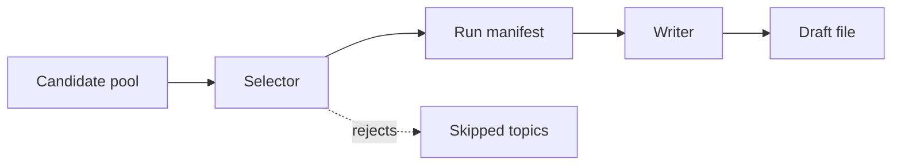

I used to let one prompt do two jobs: choose the daily topic and write the post.

That sounds efficient. It is also how you end up with prose that is very confident about a topic the picker should have rejected.

## What broke

When the same agent is responsible for both selection and prose, the writer starts to rationalize its own candidate.

That creates a subtle failure mode:

- weak topics sound stronger after a little polishing
- borderline duplicates feel "different enough"
- the final draft reflects the writing talent of the system, not the quality of the choice

The post can still read well and still be the wrong post.

## Root cause

I was mixing two contracts that should stay separate:

- the selector needs to be boring, strict, and easy to audit
- the writer needs to be flexible, human, and good at shaping the final copy

If the writer sees the whole candidate pool, it can talk itself into a near-duplicate. If the selector sees the prose, it can get seduced by a nice-sounding angle and forget the actual guardrails.

That is not a model problem. It is a boundary problem.

## The fix

I split the run into two passes:

1. select one topic from plain data
2. hand the writer only the chosen topic and the rejection summary

The writer does not get to re-open the whole search space. It gets a short manifest:

- chosen topic
- why it won
- why close alternatives lost
- any rotation rules that mattered

That split keeps each step honest.

## Why this helps

Once selection and generation are separate, a few nice things happen:

1. duplicate checks stay visible instead of getting rewritten by prose
2. topic rotation stays a policy decision, not a writing mood
3. retries can reuse the same choice without re-litigating the whole pool
4. the final draft gets to be good without being allowed to be clever about the wrong thing

It also makes debugging simpler. If the post is off, I can ask a narrow question:

- did the selector choose badly, or
- did the writer fail to explain a good choice clearly?

Those are different bugs, and they should not share the same fix.

## Verification

My check is small and repeatable:

1. run the selector twice against the same input
2. confirm it picks the same topic both times
3. swap the writer prompt and confirm the topic does not change
4. confirm the draft only sees the chosen topic, not the full candidate pool

If the writer can still change the subject, the boundary is not real yet.

## Takeaway

For daily drafting, I want one brain for choosing and another for writing.

Selection should be strict. Writing should be expressive. Mixing those jobs makes the output look smarter than the decision behind it.
